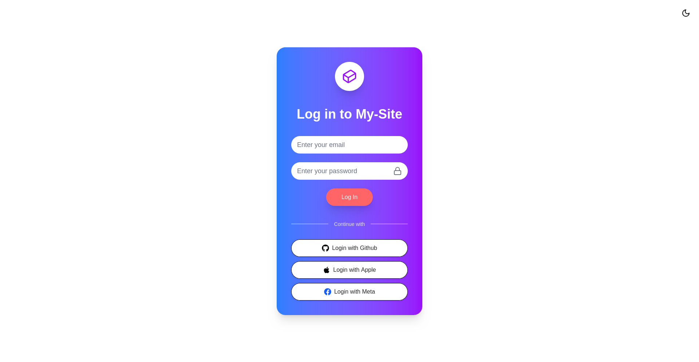
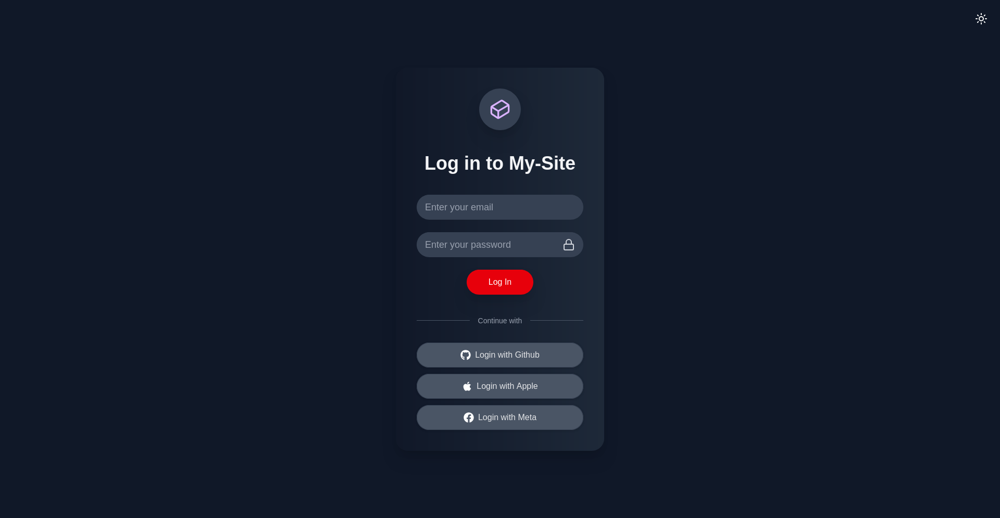

# Modern Login Mock

A visually appealing, responsive login page mockup built using **Next.js 14**, **React**, and **Tailwind CSS**.

This mock features:

- A dark/light theme toggle
- Social login buttons (non-functional)
- A clean, modern UI design

> ⚠️ **Note:** This is a _frontend-only_ mockup for design demonstration. No backend or authentication logic is implemented.

## ✨ Live Demo

Check it out here: [modern-login-mock.vercel.app](https://modern-login-mock.vercel.app/)

## 🚀 Technologies Used

- [Next.js](https://nextjs.org/)
- [Tailwind CSS](https://tailwindcss.com/)
- [React Icons](https://react-icons.github.io/react-icons/)
- [Lucide React](https://lucide.dev/)

## 📸 Preview

### 🔆 Light Mode



### 🌙 Dark Mode



## 📦 Getting Started

```bash
git clone https://github.com/MandalTuhin/modern-login-mock
cd modern-login-mock
npm install
npm run dev
```

Open [http://localhost:3000](http://localhost:3000) in your browser to see the login page.

## 📁 Project Structure

- `src/app/` — Main page components
- `src/components/ThemeToggle.js` — Theme toggle logic
- `src/app/globals.css` — Tailwind and custom global styles

## 🎛️ Customization

- Edit `src/app/page.js` to customize the login form and social buttons.
- Update styles in `globals.css` or extend with Tailwind classes as needed.

## ☁️ Deploy

The easiest way to deploy your Next.js app is to use the [Vercel Platform](https://vercel.com/new?utm_medium=default-template&filter=next.js&utm_source=create-next-app&utm_campaign=create-next-app-readme).

Check out the [Next.js deployment documentation](https://nextjs.org/docs/app/building-your-application/deploying) for more details.

## 📝 License

This project is licensed under the [MIT License](./LICENSE).
